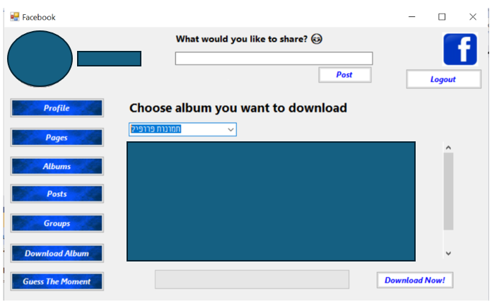

# Facebook Desktop App - Features Documentation

## Introduction
This project is a desktop application that integrates with the **Facebook API**, allowing users to interact with their photo albums and play a guessing game. Below are the descriptions of two implemented features.

---

## Feature 1: GetRandomPhotoFromRandomAlbum

### Description
This feature provides an interactive game where the user must guess the date a randomly selected photo was taken. The system randomly selects an album and a photo from that album, and the user must choose a date. Based on their selection, they receive feedback on whether their guess was correct.

### Implementation Details
- The feature is managed by the class **GuessTheMomentManager**.
- The user interacts with the feature through functions located in **FormMain**.

### Related Functions (FormMain)
- `initCheckListBoxDatesOptions()` – Initializes the available date options.
- `buttonGuessTheMoment_Click()` – Handles the guess submission.
- `buttonCheckMatch_Click()` – Checks if the guessed date matches the correct date.
- `checkedListBoxDatesOptions_ItemCheck()` – Updates UI elements based on user input.

### Technologies Used
- **C# .NET WinForms**
- **Facebook Graph API**

### How to Use
1. Open the application.
2. Navigate to the "Guess the Moment" game.
3. The system will display a random photo.
4. Select the date you believe the photo was taken.
5. Click "Guess" to receive feedback.

---

## Feature 2: DownloadAlbum

### Description
This feature allows users to select an album from their Facebook photos, preview its contents, and download it to a specified directory on their computer.

### Implementation Details
- The user selects an album from a dropdown list.
- The images from the selected album are displayed for confirmation.
- Clicking the "Download" button prompts the user to select a destination folder.
- The images are then saved to the chosen directory.

### Related Functions (FormMain)
- `initAlbumsOptionsForDownload()` – Initializes the album selection dropdown.
- `displayImages()` – Shows images from the selected album.
- `downloadPhoto()` – Handles downloading individual photos.
- `downloadAlbum()` – Handles downloading the entire album.
- `comboBoxAlbums_SelectedValueChanged()` – Detects changes in album selection.
- `buttonDownloadAlbum_Click()` – Initiates album download process.
- `buttonDownload_Click()` – Confirms and completes the download.

### Technologies Used
- **C# .NET WinForms**
- **Facebook Graph API**
- **System.IO for file handling**

### How to Use
1. Open the application.
2. Navigate to the "Download Album" section.
3. Select an album from the dropdown menu.
4. Verify the displayed images.
5. Click "Download Album" and choose a save location.
6. The images will be downloaded to the selected folder.

## Setup & Execution
### Prerequisites
- Windows OS with .NET Framework installed
- Facebook API credentials

### Steps to Run
1. Clone the repository.
2. Open the project in **Visual Studio**.
3. Configure Facebook API credentials in `FacebookService.cs`.
4. Build and run the application.

---

## Notes
- The application follows **Object-Oriented Design Principles**.
- Diagrams for **Use Cases, Sequence Flow, and Class Structure** are included in the project documentation.
- Ensure you have a valid Facebook login session for API access.

** You can view the UML's in the attached Picture folder
